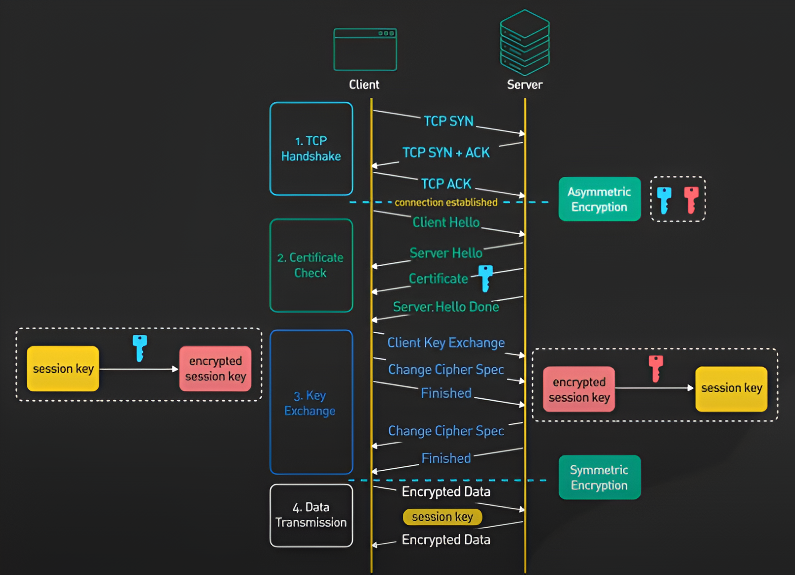
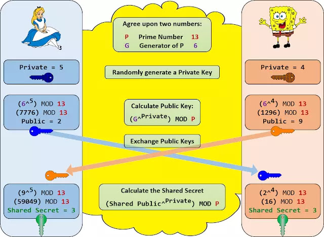

# SSL/TLS Basics

## What is SSL/TLS?

SSL (Secure Sockets Layer) and TLS (Transport Layer Security) are cryptographic protocols designed to provide secure communication over a computer network, especially the internet. They ensure the confidentiality, integrity, and authenticity of data transmitted between two parties, such as a client (usually a web browser) and a server (such as a website).

__SSL (Secure Sockets Layer):__
- SSL was the first protocol developed by Netscape in the mid-1990s to secure internet communications.
- It encrypts data so that it can't be read by unauthorized third parties.
- SSL also authenticates the server to ensure the client is connecting to the correct server.
- SSL has several versions, but the last officially supported version was SSL 3.0, released in 1996.  

__TLS (Transport Layer Security):__
- TLS is the successor to SSL, introduced by the Internet Engineering Task Force (IETF) in 1999.
- It is an updated, more secure version of SSL, designed to fix vulnerabilities in SSL and improve security.
- TLS also encrypts data during transmission and provides authentication.
- Over time, TLS has had several versions, with TLS 1.2 (released in 2008) being widely used, and TLS 1.3 (released in 2018) being the latest version.

## Key Features of SSL/TLS  

__Encryption:__ Ensures that the data being transferred is unreadable by unauthorized third parties.  
__Authentication:__ Verifies the identity of the parties involved, ensuring that the client is talking to the correct server.  
__Integrity:__ Ensures that the data has not been altered during transmission by using checksums or hash functions.  

# Basic Difference Between SSL and TLS
| Feature                  | SSL (Secure Sockets Layer)                          | TLS (Transport Layer Security)                                      |
| ------------------------ | --------------------------------------------------- | ------------------------------------------------------------------- |
| **Version**              | SSL 1.0, SSL 2.0, SSL 3.0 (obsolete now)            | TLS 1.0, TLS 1.1, TLS 1.2, TLS 1.3                                  |
| **Security**             | Older, less secure, and has known vulnerabilities   | More secure with improved encryption algorithms and performance     |
| **Protocol Version**     | SSL 3.0 was the last version of SSL, now deprecated | TLS 1.0 is based on SSL 3.0, TLS 1.2 and TLS 1.3 are more secure    |
| **Encryption**           | Uses less robust encryption methods                 | Uses stronger encryption and more secure cipher suites              |
| **Handshake Process**    | SSL handshake is less efficient and slower          | TLS handshake is optimized for better performance and security      |
| **Public Key Algorithm** | SSL supports older and less secure algorithms       | TLS supports newer, more secure public key algorithms (such as ECC) |

## SSL/TLS Handshake Process

__Basic Difference Between SSL and TLS Handshake Process__

| Feature                      | SSL Handshake                                | TLS Handshake                                         |
| ---------------------------- | -------------------------------------------- | ----------------------------------------------------- |
| **Version Negotiation**      | Simple, less secure negotiation              | More flexible and secure version negotiation          |
| **Cipher Suite Negotiation** | Limited and less secure cipher suite options | More granular and secure cipher suite selection       |
| **Key Exchange**             | RSA key exchange by default, not as secure   | ECDHE, DHE, and other more secure key exchanges       |
| **Message Integrity**        | Uses MAC (less secure)                       | Uses HMAC (stronger and more secure)                  |
| **Forward Secrecy**          | Not supported                                | Supported in modern versions (ECDHE, DHE)             |
| **Session Resumption**       | Less efficient session resumption            | Efficient session resumption with session tickets     |
| **Server Authentication**    | Basic server authentication                  | Stronger server authentication with better validation |
| **Performance**              | Slower due to outdated processes             | Faster, especially in TLS 1.3                         |

### Essential Key Features Overview
1. __Message Integrity:__

    In cryptographic protocols like SSL and TLS, message integrity ensures that the data being sent between the client and server has not been tampered with during transmission. Both SSL and TLS use Message Authentication Codes (MAC) for this purpose, but they differ in the specific type of MAC they use.

    __Message Authentication Code (MAC):__ A MAC is a small piece of data generated from the original message and a secret key. It is used to verify both the integrity (that the message has not been altered) and authenticity (that the message is indeed from the claimed sender) of the message.  

    __SSL (Uses MAC)__
    - In SSL, the protocol uses a simpler form of MAC, simply referred to as MAC (Message Authentication Code). While it serves the purpose of verifying the integrity of the data, it is less secure because of the underlying cryptographic algorithms used. SSL's MAC mechanism is vulnerable to certain types of attacks, such as birthday attacks and length extension attacks. This made SSL's MAC more susceptible to exploitation, weakening its security.

    __TLS (Uses HMAC)__
    - TLS, on the other hand, uses a more secure form of MAC called __HMAC (Hashed Message Authentication Code)__. HMAC combines a cryptographic hash function (such as SHA-256) with a secret key to create a more robust method for ensuring message integrity.
    - HMAC is more secure than regular MAC because it applies the hash function twice, making it harder for attackers to guess or tamper with the message.
    - HMAC is resistant to the attacks that affected SSL's MAC, such as birthday attacks or length extension attacks, making it far more secure in verifying message integrity.

2. __Forward Secrecy:__
   
    (also known as Perfect Forward Secrecy, or PFS) is a property of cryptographic systems where the compromise of long-term keys (such as a server's private key) does not compromise the confidentiality of past communication sessions. In simpler terms, forward secrecy ensures that even if an attacker gains access to a server’s private key at some point in the future, they cannot decrypt past sessions (data that was transmitted in the past) that were secured using that key.

    __In SSL, the key exchange process (especially in SSL 2.0 and SSL 3.0) relies on RSA key exchange to establish a shared session key. Here’s how this works:__
      - The client generates a random pre-master secret and encrypts it with the server's public key (which is part of the server’s SSL certificate).
      - The encrypted pre-master secret is sent to the server, which decrypts it using its private key.
      - Both the client and the server generate a session key using the pre-master secret to encrypt and decrypt the communication.
      - The problem with this approach is that the server's private key is used for decryption during the key exchange process. If an attacker obtains the server’s private key (either through an attack or by compromising the server), they can use it to decrypt the pre-master secret from any past session and retrieve the session key used in that session. This means they could decrypt past communications, violating forward secrecy.

    __How Forward Secrecy Is Supported in Modern TLS:__

      - TLS (Transport Layer Security) with forward secrecy uses key exchange methods like __Diffie-Hellman (DH)__ or __Elliptic Curve Diffie-Hellman (ECDH)__.
      - Diffie-Hellman key exchange allows both the server and the client to create a shared session key without directly transmitting it.
      - The session key is based on the exchange of public keys and mathematical operations, meaning the server's long-term private key is not involved in deriving the session key.
      - Even if the server's private key is compromised later, it cannot be used to decrypt past sessions, as the session key was never derived using the server's private key, ensuring that the confidentiality of past communications remains intact.   

        

      - The private random value, generated independently by both the server and the client are not transmitted over the network, can only be derived through brute-force method if all other variables are known.
      - Also the private random value is a large number, making it computationally infeasible to derive even through brute-force attempts.

__FYI:__ 

__Methods for key exchange:__
1. RSA (non-forward secrecy)
2. Diffie-Hellman (DH) (with/without forward secrecy)
3. Elliptic Curve Diffie-Hellman (ECDH) (with/without forward secrecy)
4. Pre-Shared Key (PSK)
5. Anonymous Diffie-Hellman (ADH) (forward secrecy, no authentication)
6. RSA Key Transport (deprecated and insecure)
7. Hybrid Methods (less common, deprecated)

# Need of Certificates in SSL/TLS

In SSL/TLS, a certificate serves a critical role in ensuring the security, authenticity, and trustworthiness of a communication channel between a client (typically a browser) and a server. The primary purpose of a certificate in SSL/TLS can be broken down into the following key functions:

1. __Authentication (Identity Verification)__
- The SSL/TLS certificate helps to authenticate the identity of the server (and sometimes the client).
- It provides proof that the server you are connecting to is the legitimate server you intend to communicate with, ensuring you are not connecting to an imposter or a malicious third-party.
- The certificate includes information about the server, such as its domain name, organization, and geographical location.

__Example:__ When a browser connects to https://example.com, the SSL/TLS certificate confirms that the server is indeed example.com, and not a fraudulent website attempting to impersonate it.

2. __Encryption (Securing Data)__
- The certificate contains a public key, which is used in asymmetric encryption to establish a secure communication channel between the client and the server.
- During the handshake process in SSL/TLS, the server's public key is used by the client to encrypt a session key, which will be used for symmetric encryption of the actual data.
- This encryption ensures that data transmitted between the client and the server cannot be read or tampered with by unauthorized parties (man-in-the-middle attacks).
  
__Example:__ If you're sending sensitive data like passwords or credit card details, the SSL/TLS certificate ensures that this data is encrypted and cannot be intercepted in plain text.

3. __Integrity (Data Integrity Verification)__
- SSL/TLS certificates play a role in ensuring data integrity by protecting the data from being altered during transit. It ensures that the message received by the client is identical to what the server sent, without any tampering.
- This is typically done through the use of message authentication codes (MACs) or digital signatures.
  
__Example:__ If a hacker attempts to change the content of a message being sent, the integrity check will fail, and the client will detect the tampering.

4. __Establishing Trust (Certification Authorities)__
- SSL/TLS certificates are issued by trusted Certificate Authorities (CAs). CAs are organizations that validate the identity of the certificate requester (e.g., a website or organization) and then issue a certificate.
- Web browsers and operating systems maintain a list of trusted CAs. When a client connects to a server, it checks the validity of the certificate by verifying that it was issued by a trusted CA and that it hasn’t expired or been revoked.
- This creates a chain of trust that ensures the certificate is legitimate and reliable.

__Example:__ When you visit a website that uses SSL/TLS, your browser checks the certificate’s validity against a trusted CA list to ensure the server's identity is verified.

## Role of Certificate Authority

__SSL/TLS Handshake Overview:__
During the SSL/TLS handshake, when a client tries to establish a secure connection with a server, the server sends its public key. The client uses this public key to encrypt and send the session key, which is then used for secure communication.

__The Risk of Man-in-the-Middle Attacks:__
However, a potential attacker can intercept the communication. They could send their own public key, pretending to be the server. The client, believing this to be the real server, might encrypt the session key with the attacker’s public key and send it. As a result, the attacker could intercept the session key and decrypt the communication.

__The Role of Certificates:__
To solve this problem, the server provides a certificate during the handshake. The certificate contains the server’s identity and public key, allowing the client to confirm the server’s authenticity.

__The Threat of Fake Certificates:__
An attacker could also create a fake certificate and send it to the client. To prevent this, a trusted third party is involved.

__Certificate Authority (CA):__
This is where the Certificate Authority (CA) comes into play. The CA is a trusted organization that both the server and client trust. The server sends its certificate to the CA, which then validates the server’s identity and signs the certificate with its own private key.

__How the Client Verifies the Server’s Certificate:__
Once the CA signs the server’s certificate, the server sends it to the client. The client also has the CA’s public key (which is pre-installed in the client’s trust store). Using the CA’s public key, the client can verify the authenticity of the certificate. If the certificate is valid and correctly signed by the CA, the client can be sure that the server is legitimate, and the communication is secure.

__Trust and Security:__
Because the certificate is signed by a trusted CA, it ensures that no third party can fake the server’s identity. Only the real server, verified by the CA, can use the signed certificate to establish a secure connection.
